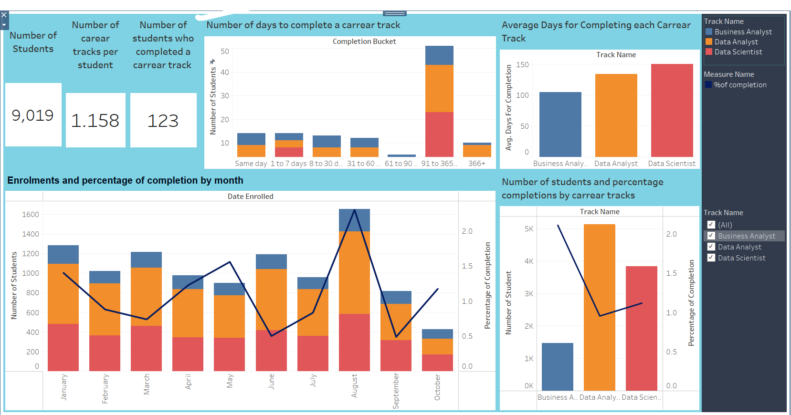

# Career Track Analysis with SQL and Tableau

## Project Overview
This project analyzes student enrollments and completions in career tracks offered by the 365 e-learning platform. Career tracks are structured sequences of courses aimed at preparing students for roles such as Data Scientist, Data Analyst, or Business Analyst. The analysis uses SQL to preprocess enrollment data and Tableau to visualize trends and insights.

## Objective
The main objective was to:
- Analyze enrollment trends across different career tracks.
- Evaluate career track completion rates and their timeframes.
- Provide actionable insights to improve engagement and completion rates.
- Develop a Tableau dashboard for dynamic data exploration.

## Problem Statement
Despite the popularity of career tracks, the platform faced challenges such as:
- Low completion rates (only 123 completions out of 9019 students in the dataset).
- Limited insights into which career tracks were more engaging or achievable.
- Lack of clarity on the most suitable subscription plans for students aiming to complete tracks.

## What Was Done
### Data Preprocessing in SQL
- Created a comprehensive dataset with fields such as:
  - Track name, enrollment dates, completion status, and time to completion.
  - Completion buckets categorizing students by time taken (e.g., 1–7 days, 91–365 days).
- Ensured data integrity and handled edge cases (e.g., no enrollments after completion dates).

### Dashboard Development in Tableau
1. **Enrollment Trends**:
   - Bar chart showing monthly enrollments and line chart for monthly completion percentages.
2. **Completion Buckets**:
   - Bar chart categorizing students by time taken to complete tracks.
3. **Career Track Comparison**:
   - Bar chart for enrollments by career track and line chart for completion percentages.
4. **Average Completion Time**:
   - Bar chart highlighting average days to complete for each career track.
5. **Summary Cards**:
   - Key metrics such as total students, completions, and average tracks per student.

     
   *Figure: Dashboard*

### Analysis and Insights
1. **Monthly Enrollment Trends**:
   - August had the highest enrollments but the lowest completion percentage.
   - Enrollment numbers were stable from January to July but dropped after August.

2. **Popular Career Tracks**:
   - Most enrollments were for Data Analyst, followed by Data Scientist and Business Analyst.
   - Completion rates were inversely proportional to enrollments, with Business Analyst having the highest completion rate.

3. **Completion Time**:
   - Most students completed a track within 91–365 days, but a significant proportion finished within 60 days.
   - Data Science tracks required the most time (average 150 days), while Business Analyst tracks were the quickest (average 105 days).

4. **Suitable Subscription Plans**:
   - Monthly plans work well for fast learners, while quarterly plans suit most students aiming to complete tracks.

5. **Recommendations**:
   - Target a more focused audience, such as professionals with related job experience (e.g., software engineers transitioning to data roles).
   - Use behavioral patterns from students who completed tracks to refine marketing strategies.
   - Enhance gamification features and provide tailored reminders or incentives to improve engagement.

## Conclusion
This analysis highlights the challenges of low completion rates and offers actionable insights to boost student engagement. By refining subscription plans and targeting specific audiences, the platform can improve its conversion rates and better support students in achieving their career goals.
